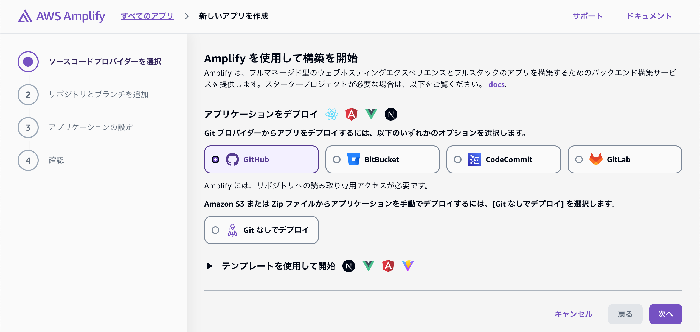
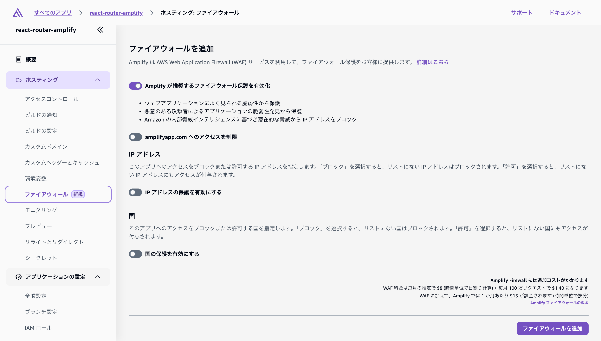

# AWS Amplify Hosting 5つの推しポイント!

村上 雅彦 a.k.a @fossamagna

フロントエンド開発者にとって、デプロイは常に悩ましい問題の一つです。CI/CD の仕組みを整え、セキュリティ対策も施しつつ、ユーザー体験に優れたWebアプリケーションを素早く届けたい。そんなニーズに応えるのが、**AWS Amplify Hosting** です。今回は、私が実際に使って感じた AWS Amplify Hosting の推しポイントを紹介します。

## Gitリポジトリ連携とCI/CD機能でデプロイが自動化される

AWS Amplify Hosting は、GitHub・GitLab・Bitbucket などの Git リポジトリと簡単に連携でき、プルリクエストやマージに応じて自動でビルド＆デプロイが走ります。

たとえば、`main`ブランチにマージすると本番環境に自動デプロイ、`dev`ブランチでは開発環境に…といった構成も数回のクリック操作で CI/CD パイプラインの設定が完了します。
また、`amplify.yml` というビルド・デプロイの処理を構成するファイルを作成して Git リポジトリにコミットしておくと任意のビルド・デプロイの処理を構成することも可能です。

## Preview 機能で事前確認が可能

AWS Amplify Hosting では、Pull Request 毎にプレビュー用のURLを自動生成してくれます。チームメンバーやステークホルダーに、マージ前の変更内容をURLで共有できるため、レビューの質も向上します。Vercel や Netlify でおなじみのこの機能、AWS Amplify でも完全サポートされています。

## SSR（サーバーサイドレンダリング）対応

AWS Amplify Hosting は単なる静的サイトホスティングだけではなく、SSR（サーバーサイドレンダリング）にも対応しています。`Next.js` と `Nuxt.js` がAWSで公式にサポートされています。

そして最大の推しポイントなのが、デプロイ仕様が公開されているので **公式サポートされていないフレームワークでもコミュニティベースで SSR 対応が可能** という点です。たとえば `Astro.js` や `SvelteKit` のようなフレームワークも、コミュニティベースで開発されているAmplify Hosting SSR対応パッケージあり、それを利用すると簡単に Amplify Hosting 上でSSRを実現できます。

私自身もこの推しポイントを利用して、React Router v7 Framework の SSR 構成を Amplify Hosting にデプロイするための 👉[vite-plugin-react-router-amplify-hosting](https://www.npmjs.com/package/vite-plugin-react-router-amplify-hosting) というライブラリ開発・公開しています。

仕様が公開されていることで利用者が必要とするフレームワークもSSRに対応したデプロイメントができるので最高です。

## WAF（AWS Web Application Firewall）と連携可能でセキュリティも安心

Amplify Hosting は、AWS WAFとの連携が可能です。以前からのAmplifyユーザーからすると待ち焦がれた機能ですが、2025年3月26日にようやくGAになりプロダクション環境でも利用できるようになりました。
IP制限・SQLインジェクション対策・ボットブロッキングなど、Web アプリケーションに不可欠なセキュリティ対策を、Amplify Hosting を使いながら実現できます。

現場ではWAFの導入が必須という場合も多いと思いますが、そんなケースにもAmplify Hostingは対応できます。

## BASIC認証が簡単にできる

ちょっとした検証用環境や開発中のプレビュー環境において、BASIC 認証をつけたいケースもあると思います。Amplify Hosting では ブランチ毎にBASIC認証を設定することができます。
CloudFront + S3などでホスティングしている場合、CloudFront Functions で BASIC 認証を実施して対応しているのではないでしょうか？
Amplify Hostingでは数クリックで実現できるので、コードを書く必要もありません。ちょっとしたことですが、数クリックでBASIC 認証を設定できるのは実務では意外と重宝します。

## まとめ

AWS Amplify Hosting は、単純な静的サイトのホスティングにとどまらず、SSR対応、WAF対応、Preview機能、Git連携、BASIC認証など、実際の現場で役立つ機能を数多く備えています。
AWS 環境に親しんでいる開発者はもちろん、初学者にも非常に扱いやすいサービスです。

「デプロイ環境、どうしよう？」と迷っているなら、Amplify Hosting をぜひ使ってもらいたいと私は思います。

#### 著者紹介

---

    
    

        

            <b>村上 雅彦 ( fossamagna )</b>
        

        

            X：<a href="https://x.com/fossamagna">https://x.com/fossamagna</a>
        

        

            GitHub：<a href="https://github.com/fossamagna">https://github.com/fossamagna</a>
        

        

            Speakerdeck：<a href="https://speakerdeck.com/fossamagna">https://speakerdeck.com/fossamagna</a>
        

        

            所属：<a href="https://aws-amplify-jp.github.io/">Amplify Japan User Group</a>
        

    

ソフトウェアエンジニアとして主にWeb・モバイルアプリの開発に従事しています。趣味でAWS Amplify関連のリポジトリにコントリビューションしています。Amplify Japan User Group運営メンバー / AWS Community Builder (Front-End Web & Mobile since 2022)

