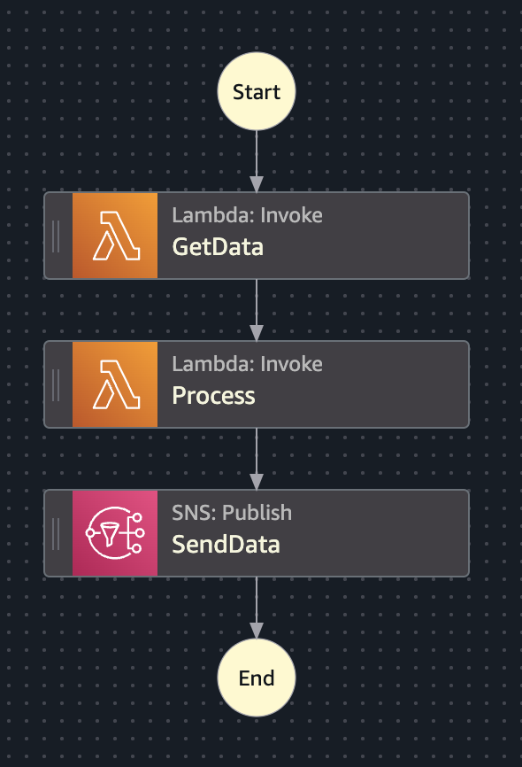
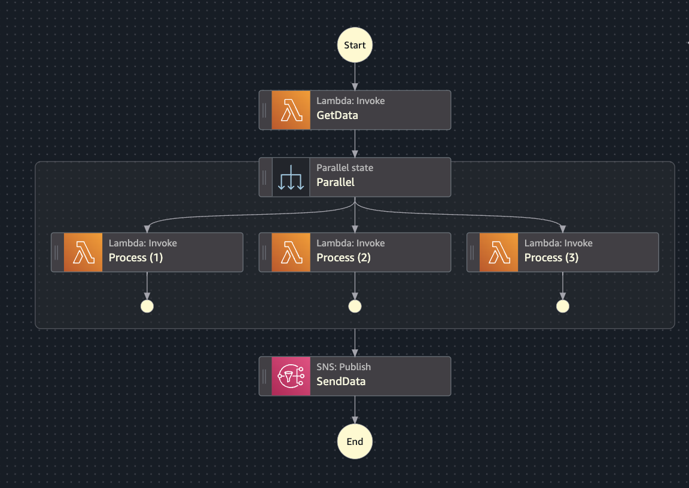
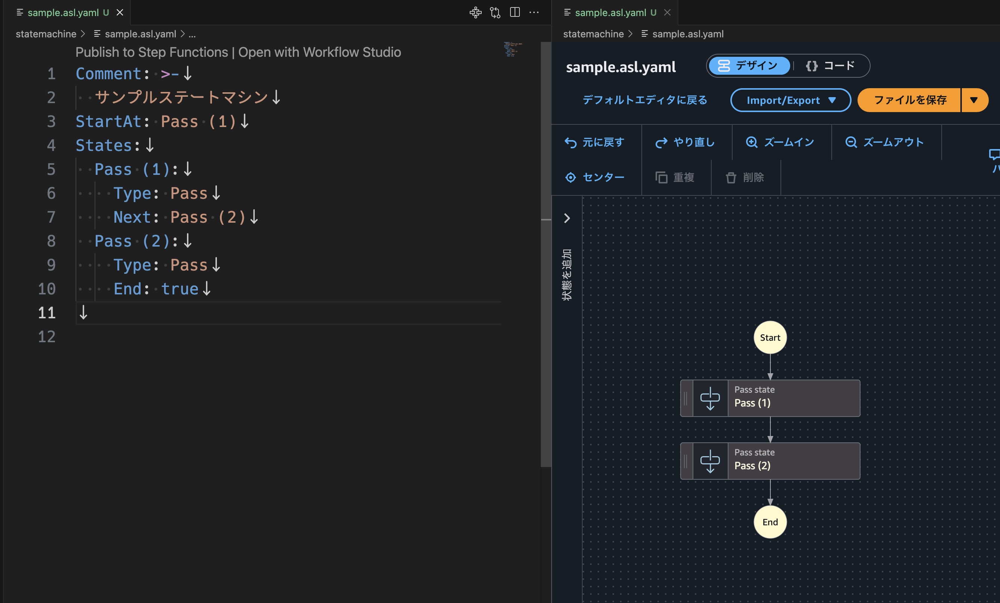
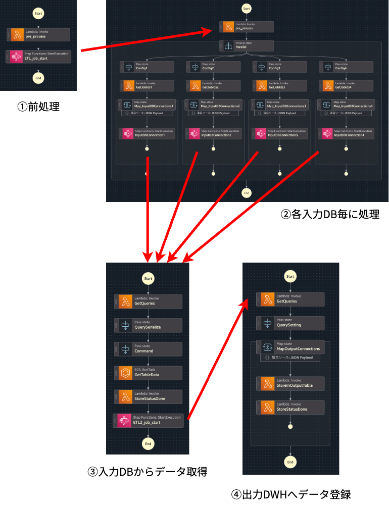
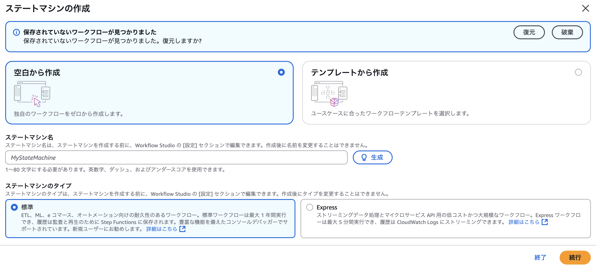

# AWS Step Functionsでフロー制御してみないか？

<div class="flush-right">
笠原 宏 @kasacchiful
</div>

## AWSサービスの実行をサーバーレスで制御する

私は普段サーバーレスでデータ基盤を構築することが多いです。
サーバーレスで構築するにあたって、
各サービスの実行をオーケストレーションできると制御が容易です。
このオーケストレーションを行うサービスとして、私はAWS Step Functionsを好んで利用しています。

## AWS Step Functionsとは

AWS Step Functionsは、AWSの複数のサービスをサーバーレスのワークフローにオーケストレーションできるサービスです。
AWSマネジメントコンソール上では、GUIでワークフローを構築できます。

例えば、単純な順列処理の制御も可能ですし、並列処理の制御も可能です。
もちろん、分岐処理やエラーハンドリングもできます。

{width=40%}

{width=60%}

AWS Step Functionsからは、AWS Lambdaをはじめ、200以上のAWSサービスを実行することができます。また、AWS Step Functionsの最適化統合を利用することで、ワークフローに特別な機能を利用することができます。
非常に柔軟に制御可能です

例えば、以下の用途はAWS Step Functionsのワークフローから実行できます。

- Lambda関数を呼び出す
- ECSタスクを呼び出す、完了するまで待機する
- SNSトピックにメッセージをパブリッシュする
- SQSキューにメッセージを送信する
- DynamoDBに項目を挿入する、取得する
- Glueジョブを管理する
- 他のStep Functionsのワークフローを実行する
- etc.

[AWS公式ドキュメント](https://docs.aws.amazon.com/ja_jp/step-functions/latest/dg/integrate-services.html)<span class="footnote">https://docs.aws.amazon.com/ja_jp/step-functions/latest/dg/integrate-services.html</span>上では、最適化統合に対応しているサービスの一覧が掲載されていますので、ご参考ください。

## AWS Step Functionsの推しポイント

### 処理フローの可視化

ワークフローは「ステートマシン」として定義され、
ステートマシンはAWSマネジメントコンソース上で可視化されます。
Visual Studio Code上でも「AWS Toolkit」の拡張機能をインストールすればAWS Step Functions Workflow Studioが動作しますので、定義内容を可視化できます。

私はデータ基盤の構成を検討する際に、まずステートマシンをYAMLで定義することで全体のフローを整理します。ステートは基本 `Pass` を用い、分岐や並列処理を必要に応じて記載します。
Workflow Studioを使えばGUIで構築できますが、私はYAMLでゴリゴリ書きたい派です。

各ステートで `Pass` にあたる部分は Lambda や ECS 等のAWSサービス実行に置き換わる想定になりますが、処理フローを可視化してイメージ通りの構成で動きそうか確認します。
その後、ペイロード部分も仮で記載し、ペイロードの構成や処理前後の値の想定値を確認します。

{width=70%}

大きすぎるステートマシンは、適宜分割します<span class="footnote">私の構成するステートマシン全体では、イベント履歴のクォータ「25,000」を基本超えるので、ステートマシン分割しないとそもそも動作しないケースがほとんどです。</span>。その際はステートマシン間でのペイロードも検討します。

このように、処理フローを可視化して動作が想定通り動くか、事前に検証するのにAWS Step Functionsのステートマシンはうってつけです。
巨大なステートマシンは分割することで、各ステートマシンの役割をはっきりさせることもできます。

{width=80%}

### Lambdaに頼らなくてもいい

前述の可視化の際は基本 `Pass` ステートを使用します。
`Pass` ステートは `Task` ステートに置き換えて、Lambda等各種AWSサービスに置き換える想定でいます。
Lambda以外にも、通知であればSNS、メッセージキューならSQSなど、AWS Step Functionsから直接実行可能なサービスは非常に多いです。Lambdaで他のAWSサービスを実行する等、どうしてもLambdaに頼ってしまう方は、AWS Step Functionsのステートマシンから直接実行してみてはいかがでしょうか？

また、単純なペイロードの編集であれば `Pass` ステートのまま構成することもあります。
AWS Step Functionsはステートマシンのクエリ言語として、デフォルトの「JSONPath」または推奨の「JSONata」を選べます。
「JSONata」であれば結構複雑なJSON処理も可能なので、単純なペイロードの編集であれば、 `Pass` ステートのままペイロード編集を行うステートとして活用してみましょう。

```yaml
  Db_Query_Serialize:
    QueryLanguage: JSONata
    Type: Pass
    Output:
      target_date: ""    ## 入力をそのまま出力する
      query_serialize: ""   ## JSONシリアライズ化処理
      query_job_id_list: ""  ## 三項演算子で条件分岐処理
    Next: Db_Command
```

### バッチ処理にも、ニアリアルタイム処理にも

私は普段日次や月次のバッチ処理にて動作するデータフローを構成することが多いですが、たまに5分以内の比較的早い処理を求められるケースがあります。

AWS Step Functionsでは、通常の標準ワークフローの他にExpressワークフローも存在します。
標準ワークフローは24時間以内の通常のワークフロー制御に優れていますが、Expressワークフローは制限時間5分以内ではありますが、高速で動作するワークフローであるため、例えばWebやAPIのバックエンド処理にLambdaではなくExpressワークフローを使うケースも有用です。

制御したいワークフローに応じてうまく使い分けていきましょう。

{width=70%}

## まとめ

AWS Step Functionsは非常に強力な機能を持ったサーバーレスオーケストレーションサービスです。
Step Functionsでワークフローを制御することで、AWSの各種サービス間の連携を上手に行うことができます。
皆さんもまずはGUIでワークフローを構築して、フロー制御してみませんか？

#### 著者紹介

---

<div class="author-profile">
    
    <div>
        <div>
            <b>笠原 宏</b> <a href="https://x.com/kasacchiful">@kasacchiful</a>
        </div>
        <div>
            所属：<a href="https://jawsug-niigata.connpass.com/">JAWS-UG 新潟</a>
        </div>
    </div>
</div>
<p style="margin-top: 0.5em; margin-bottom: 2em;">
新潟でWeb、業務アプリ、インフラ等とりあえずなんでもやるエンジニア。<br>
現在は、お客様のデータ基盤構築の設計や検証をメインでやっています。
データ基盤はサーバーレス構成で構築することが多く、AWS Step Functionsにはだいぶお世話になっています。<br>
好きなAWSサービスは、S3・Lambda・Step Functionsです。<br>
・AWS Community Builder (Serverless since 2022)
</p>
