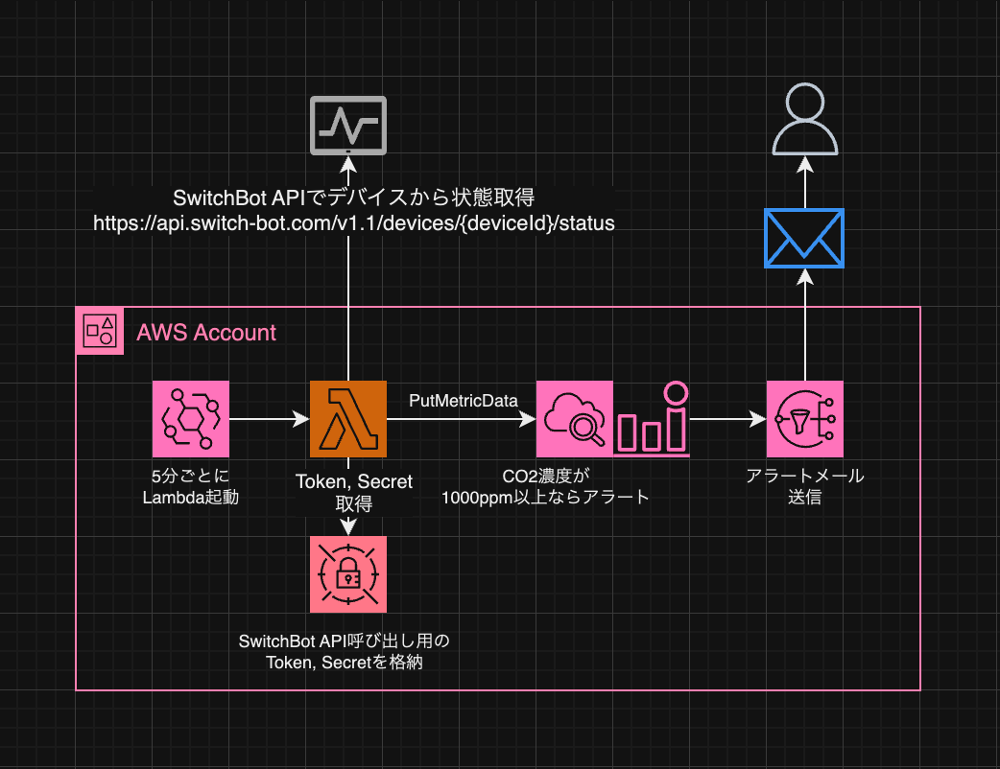
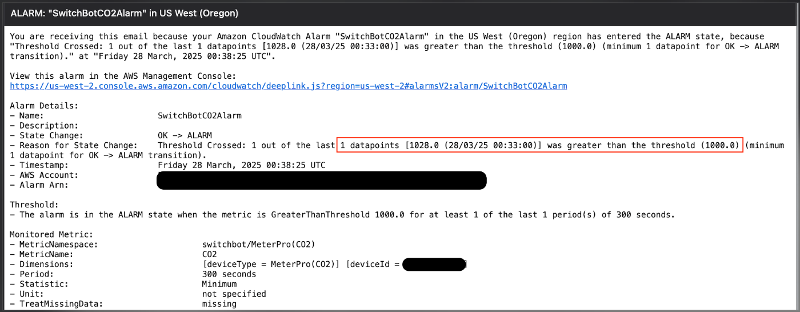

# Amazon CloudWatch MetricsとSwitchBotで始める部屋環境の監視

<div class="flush-right">
須賀 功太 (ksks)
</div>

Amazon CloudWatchのMetrics、使っていますか？デフォルトでもさまざまなメトリクスがありますが、それだけではなく自分で作ったデータをカスタムメトリクスとして登録することもできます。これを使うことで、部屋環境の情報を集めて、メトリクスの監視、可視化や通知をすることができます。自分で可視化したり、Amazon QuickSightを使ったりすると高くなってしまいますが、こちらでは比較的安価で作れている、はず。。。

今回は、その具体例として、SwitchBotのデバイスを使って、定期的に部屋の温度・湿度や二酸化炭素濃度を取得して、Amazon CloudWatchのMetricsで監視し、二酸化炭素濃度が閾値を超えた際にアラームを送った例を紹介します。


## 利用するSwitchBotデバイス

家では、この2つのデバイスを使ってます。前者の方が二酸化炭素濃度を取得できるデバイスですが、単体ではSwitchBotのAPIから取得できず、後者のハブデバイスが必要になります。

- SwitchBot CO2センサー（温湿度計）<span class="footnote">https://www.switchbot.jp/products/switchbot-co2-meter</span>
- SwitchBot ハブ2<span class="footnote">https://www.switchbot.jp/products/switchbot-hub2</span>


## 利用するSwitchBot API

今回使用するのは、下記2つのエンドポイントです。

```txt
https://api.switch-bot.com/v1.1/devices
https://api.switch-bot.com/v1.1/devices/{deviceId}/status
```

devicesは目的のデバイスのdeviceIdの取得のため、devices/{deviceId}/statusは実際のメトリクス取得のためになります。

*SwitchBot CO2センサー（温湿度計）* が対象なのでdeviceTypeは *MeterPro(CO2)* になります。

なお、APIを利用するための前提条件や、APIの種類、仕様については、GitHubリポジトリで公開<span class="footnote">https://github.com/OpenWonderLabs/SwitchBotAPI</span>されているのでご確認ください。


## 構成図

今回、下記のような構成で、監視・通知を実現しています。




## 処理の流れ

処理の流れとしては下記のようになります。

- Amazon EventBridgeで5分ごとにAWS Lambdaを起動
- AWS Lambdaにて下記を実行
  - SwitchBot API用のSecret, TokenをAWS Secrets Managerから取得
  - SwitchBot APIを実行して、メトリクスを取得
  - Amazon CloudWatchのPutMetricDataを呼び出し、CloudWatchに取得したメトリクスを登録
- メトリクスの閾値超過がある場合、Amazon CloudWatch AlarmでAmazon SNS経由でメールにてユーザに通知

## 結果

### Metrics表示

Amazon CloudWatchでMetricsを確認してみます。

{width: 80%}

AWS Lambdaで取得したメトリクスが正しくAmazon CloudWatch Metricsに登録されていることが確認できました。

### Alarm発出

AlarmのE-mailが正しく発出されることも確認しました。

{width: 80%}

AWS Management Console上のAmazon CloudWatch Alarmでも、正しく`In Alarm`状態となっています。

{width: 80%}


## まとめ

SwitchBotのデータをAmazon CloudWatch Metrics上で可視化、通知をすることで部屋の環境監視を簡単に実現できました。Amazon CloudWatch Dashboardには共有機能もある<span class="footnote">https://docs.aws.amazon.com/ja_jp/AmazonCloudWatch/latest/monitoring/cloudwatch-dashboard-sharing.html</span>ので、これらのメトリクスから自分でDashboardを作って、Webページに埋め込み表示が可能なので、家の中で常時表示とかすると更に良いかもしれませんね。

#### 著者紹介

---

<div class="author-profile">
    
    <div>
        <div>
            <b>須賀功太 (Kota Suga)</b>
            <a href="https://x.com/ksks_dev">X@ksks_dev</a>
        </div>
        <div>
            Zenn: <a href="https://zenn.dev/utaco">UtaCo</a><br/>
        </div>
    </div>
</div>
